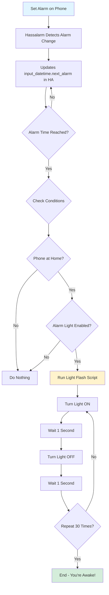

# Hassalarm Wake-Up Light Integration for Home Assistant

A complete Home Assistant integration that uses the [Hassalarm Android app](https://github.com/Johboh/hassalarm) to trigger a flashing light automation when your phone alarm goes off - but only when you're actually at home!

## 📋 Table of Contents

- [Overview](#overview)
- [Features](#features)
- [Requirements](#requirements)
- [Installation](#installation)
- [Configuration](#configuration)
- [How It Works](#how-it-works)
- [Troubleshooting](#troubleshooting)
- [Credits](#credits)

---

## 🎯 Overview

This project creates an intelligent wake-up system that:
- Automatically syncs your Android phone alarms with Home Assistant
- Triggers a light flashing sequence when the alarm goes off
- Only activates when you're at home (detected via WiFi presence)
- Provides a dashboard toggle to enable/disable the automation
- Shows visual status indicators (green/orange/red) based on your location and settings

**Perfect for:**
- People who need a gentle (or not-so-gentle) wake-up with light
- Smart home enthusiasts who want their alarms integrated with Home Assistant
- Anyone who wants location-aware alarm automations

---

## ✨ Features

- **Automatic Alarm Sync**: Your phone alarms automatically sync to Home Assistant via Hassalarm
- **Smart Light Flashing**: Light turns on/off every 2 seconds for 60 seconds when alarm triggers
- **Presence Detection**: Only triggers if your phone is connected to home WiFi
- **Dashboard Control**: Beautiful button card to enable/disable the automation
- **Visual Status**:
  - 🟢 **Green**: You're home & alarm is enabled
  - 🟠 **Orange**: Alarm enabled but you're away
  - 🔴 **Red**: Alarm is disabled
- **Next Alarm Display**: Shows when your next alarm is scheduled

---

## 📦 Requirements

### Hardware/Software
- **Home Assistant** 2020.12.1 or later
- **Android phone** with alarm clock app
- **WiFi network** for presence detection
- **Smart light** (any light entity controllable by Home Assistant)

### Home Assistant Components
- Core components (pre-installed):
  - `input_datetime`
  - `input_boolean`
  - `sensor` (time_date)
  - `history` (optional but recommended)
  - `recorder` (optional but recommended)

### HACS Frontend Components
Install these via [HACS](https://hacs.xyz/):
- **[button-card](https://github.com/custom-cards/button-card)** - For the dashboard interface

### Mobile Apps
- **[Hassalarm](https://play.google.com/store/apps/details?id=com.fjun.hassalarm)** - Android app for alarm sync
- **[Home Assistant Companion App](https://companion.home-assistant.io/)** - For phone presence detection

---

## 🚀 Installation

### Step 1: Install Hassalarm on Your Phone

1. Install [Hassalarm from Google Play Store](https://play.google.com/store/apps/details?id=com.fjun.hassalarm)
2. In Home Assistant, go to your **Profile** → **Long-Lived Access Tokens**
3. Create a new token and copy it
4. Open Hassalarm and configure:
   - **Home Assistant URL**: Your HA URL (e.g., `http://192.168.1.100:8123`)
   - **Access Token**: Paste the token you created
   - **Entity ID**: `input_datetime.next_alarm`
5. Set an alarm in your phone's clock app to test

### Step 2: Install Home Assistant Companion App

1. Install the [Home Assistant Companion App](https://play.google.com/store/apps/details?id=io.homeassistant.companion.android) on your phone
2. Log in and set up location tracking
3. Note your device tracker entity name (e.g., `device_tracker.your_phone_name`)

### Step 3: Install button-card via HACS

1. Open **HACS** in Home Assistant
2. Go to **Frontend**
3. Search for **"button-card"**
4. Click **Install**
5. **Restart Home Assistant**

---

## ⚙️ Configuration

### 1. Add to `configuration.yaml`

Add the following configuration to your `configuration.yaml` file:

```yaml
# Input datetime to store the next alarm time from Hassalarm
input_datetime:
  next_alarm:
    name: Next scheduled alarm
    has_date: true
    has_time: true

# Input boolean to enable/disable the alarm light automation
input_boolean:
  alarm_light_enabled:
    name: Alarm Light Enabled
    initial: true
    icon: mdi:lightbulb-alert

# Time sensor for triggering automations at specific times
sensor:
  - platform: time_date
    display_options:
      - 'date_time'

# Optional but recommended: Enable history and recorder
# This ensures your alarm time persists across HA restarts
history:

recorder:
```

**Why each component?**
- `input_datetime.next_alarm`: Stores the next alarm time from your phone
- `input_boolean.alarm_light_enabled`: Acts as an on/off switch for the automation
- `sensor.date_time`: Provides current date/time for comparison with alarm time
- `history` & `recorder`: Preserves data across restarts

### 2. Create the Light Flash Script

Add to `scripts.yaml`:

```yaml
alarm_light_flash:
  alias: "Alarm Light Flash"
  sequence:
    - repeat:
        count: 30  # Flashes for 60 seconds (30 cycles × 2 seconds)
        sequence:
          - action: light.turn_on
            target:
              entity_id: light.dormitor_horia_veioza_pat  # CHANGE THIS to your light entity
          - delay:
              seconds: 1
          - action: light.turn_off
            target:
              entity_id: light.dormitor_horia_veioza_pat  # CHANGE THIS to your light entity
          - delay:
              seconds: 1
```

**Important**: Replace `light.dormitor_horia_veioza_pat` with your actual light entity ID.

**How it works:**
- Repeats 30 times (60 seconds total)
- Each cycle: turns light ON for 1 second, OFF for 1 second
- Creates a flashing effect to wake you up

### 3. Create the Automation

Add to `automations.yaml`:

```yaml
- alias: "Hassalarm Wake Up Light"
  trigger:
    - trigger: template
      value_template: "{{ states('sensor.date_time') == (state_attr('input_datetime.next_alarm', 'timestamp') | int | timestamp_custom('%Y-%m-%d, %H:%M', True)) }}"
  condition:
    - condition: state
      entity_id: device_tracker.shadow  # CHANGE THIS to your device tracker
      state: "home"
    - condition: state
      entity_id: input_boolean.alarm_light_enabled
      state: "on"
  action:
    - action: script.alarm_light_flash
```

**Important**: Replace `device_tracker.shadow` with your actual device tracker entity ID.

**How it works:**
- **Trigger**: Fires when current time matches the alarm time
- **Conditions**:
  1. Your phone must be home (on WiFi)
  2. The alarm light toggle must be enabled
- **Action**: Runs the light flashing script

### 4. Restart Home Assistant

After editing `configuration.yaml`:
1. Go to **Settings** → **System** → **Restart**
2. Wait for Home Assistant to restart

For `scripts.yaml` and `automations.yaml`, you can just reload:
1. Go to **Developer Tools** → **YAML**
2. Click **"Scripts"** and **"Automations"** to reload

### 5. Add Dashboard Card

Add this to your dashboard (Edit Dashboard → Add Card → Manual):

```yaml
type: custom:button-card
entity: input_boolean.alarm_light_enabled
name: |
  [[[
    return entity.state === 'on' ? 'Alarm Light is ON' : 'Alarm Light is OFF';
  ]]]
icon: mdi:alarm-light
show_state: false
show_label: true
label: |
  [[[
    if (states['input_datetime.next_alarm']) {
      return 'Next: ' + states['input_datetime.next_alarm'].state;
    }
    return 'No alarm set';
  ]]]
tap_action:
  action: toggle
styles:
  icon:
    - width: 35px
    - color: |
        [[[ 
          var phone = states['device_tracker.shadow'];  // CHANGE THIS to your device tracker
          var phoneHome = phone && phone.state === 'home';
          var enabled = entity.state === 'on';
          
          if (phoneHome && enabled) 
            return 'green';
          else if (enabled)
            return 'orange';
          else
            return 'red';
        ]]]
  card:
    - padding: 12px
```

**Important**: Replace `device_tracker.shadow` with your actual device tracker entity ID.

**Dashboard features:**
- **Title**: Shows "Alarm Light is ON" or "Alarm Light is OFF"
- **Label**: Displays next alarm time
- **Color coding**:
  - Green = Home & enabled
  - Orange = Away & enabled
  - Red = Disabled
- **Click to toggle**: Enable/disable the automation

---

## 🔄 How It Works

### System Flow Diagram



### Detailed Logic

1. **Alarm Detection**
   - You set an alarm in any Android alarm app
   - Android broadcasts `ACTION_NEXT_ALARM_CLOCK_CHANGED`
   - Hassalarm detects this and sends the alarm time to Home Assistant
   - `input_datetime.next_alarm` is updated

2. **Presence Tracking**
   - Home Assistant Companion App tracks your phone's location
   - When connected to home WiFi, `device_tracker` state = "home"
   - When away, state = "away" or "not_home"

3. **Automation Trigger**
   - Every minute, HA compares current time with alarm time
   - When they match, the automation triggers

4. **Condition Checks**
   - Is phone at home? (Check device tracker)
   - Is alarm light enabled? (Check input_boolean)
   - Both must be true to continue

5. **Light Flashing**
   - Script runs 30 iterations
   - Each iteration: ON (1s) → OFF (1s)
   - Total duration: 60 seconds

6. **Dashboard Control**
   - Toggle button enables/disables automation
   - Color indicates status at a glance
   - Shows next scheduled alarm time

---

## 🔧 Troubleshooting

### Hassalarm Not Syncing

**Problem**: Alarm time not updating in Home Assistant

**Solutions**:
1. **Check background permissions**:
   - Settings → Apps → Hassalarm → Battery → Unrestricted
   - Disable battery optimization for Hassalarm

2. **Use Google Clock**: Some manufacturer alarm apps have bugs
   - Install [Google Clock](https://play.google.com/store/apps/details?id=com.google.android.deskclock)
   - Set alarms there instead

3. **Verify token**: Ensure your long-lived access token is valid
   - Check in Hassalarm app settings
   - Generate a new token if needed

4. **Check entity ID**: Must be exactly `input_datetime.next_alarm`

### Light Not Flashing

**Problem**: Automation doesn't trigger at alarm time

**Solutions**:
1. **Check device tracker state**:
   - Developer Tools → States
   - Find your device tracker
   - Verify it shows "home" (lowercase) when at home
   - Update automation if state is capitalized differently

2. **Check input_boolean**:
   - Make sure it's toggled ON in the dashboard

3. **Verify light entity**:
   - Developer Tools → States
   - Test manually: `light.turn_on` service
   - Replace with correct entity ID in script

4. **Check time sensor**:
   - Verify `sensor.date_time` exists
   - Should update every minute

### Dashboard Card Not Working

**Problem**: Button card shows error or doesn't update

**Solutions**:
1. **Restart after installing button-card**:
   - HACS installations require restart
   - Settings → System → Restart

2. **Clear browser cache**:
   - Hard refresh: Ctrl+F5 (Windows) or Cmd+Shift+R (Mac)
   - Or try incognito mode

3. **Verify entity IDs**:
   - Check all entity IDs in the card YAML
   - Must match your actual entities

4. **Check for JavaScript errors**:
   - Browser Console (F12)
   - Look for ButtonCardJSTemplateError

### Wrong Alarm Time

**Problem**: Alarm time in HA is off by hours

**Solutions**:
1. **Time zone mismatch**:
   - Settings → System → General
   - Set correct time zone

2. **Use Google Clock**:
   - Known bugs with Samsung and Xiaomi clocks
   - Switch to Google Clock app

---

## 🎨 Customization Ideas

### Change Flash Duration

Edit the `count` in `scripts.yaml`:
```yaml
count: 60  # 120 seconds (2 minutes)
count: 15  # 30 seconds
```

### Change Flash Speed

Edit the `delay` seconds:
```yaml
- delay:
    seconds: 0.5  # Faster flashing
```

### Multiple Lights

Add multiple lights in the script:
```yaml
- action: light.turn_on
  target:
    entity_id:
      - light.bedroom_lamp
      - light.bedside_light
      - light.hallway
```

### Add Brightness Ramp

Instead of on/off, gradually increase brightness:
```yaml
alarm_light_ramp:
  alias: "Alarm Light Ramp"
  sequence:
    - repeat:
        count: 10
        sequence:
          - action: light.turn_on
            target:
              entity_id: light.bedroom
            data:
              brightness: "{{ repeat.index * 25 }}"
          - delay:
              seconds: 6
```

### Pre-Alarm Warning

Trigger light 5 minutes before alarm:
```yaml
- alias: "Hassalarm Pre-Wake Light"
  trigger:
    - trigger: template
      value_template: "{{ ((as_timestamp(states('sensor.date_time').replace(',','')) | int) + 300) == (state_attr('input_datetime.next_alarm', 'timestamp') | int) }}"
```

---

## 📝 File Structure

Your Home Assistant configuration should look like this:

```
homeassistant/
├── configuration.yaml    # Main config with input_datetime, sensor, etc.
├── scripts.yaml         # Light flash script
├── automations.yaml     # Wake-up automation
└── ui-lovelace.yaml     # Dashboard (or via UI)
```

---

## 🙏 Credits

- **[Hassalarm](https://github.com/Johboh/hassalarm)** by [@Johboh](https://github.com/Johboh) - The Android app that makes this all possible
- **[button-card](https://github.com/custom-cards/button-card)** by [@RomRider](https://github.com/RomRider) - Beautiful custom dashboard cards
- **[Home Assistant](https://www.home-assistant.io/)** - The amazing home automation platform

---

## 📄 License

This project is provided as-is for personal use. Feel free to modify and adapt to your needs.

---

## 🤝 Contributing

Found a bug or have an improvement? Feel free to:
1. Open an issue
2. Submit a pull request
3. Share your customizations!

---

## ⭐ Support

If you find this project useful, please:
- ⭐ Star this repository
- 📢 Share it with other Home Assistant users
- 💬 Report issues or suggest improvements

---

**Happy waking up! 🌅**